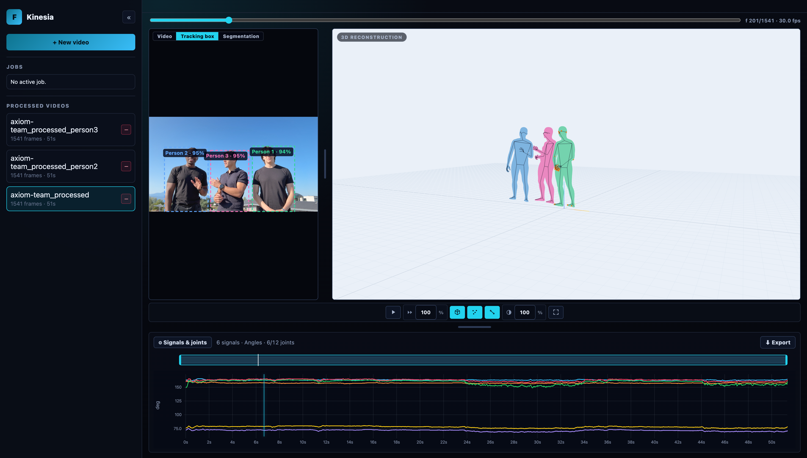
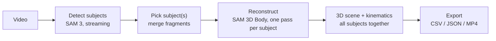

# Kinesia

**Markerless 3D human motion capture and gait kinematics from a single ordinary video.**

Kinesia turns any video of people walking or moving into per-frame **3D body meshes**
and **joint kinematics**, and displays everything in a local browser-based 3D viewer.
No suits, no markers, no multi-camera rig — one video, one machine, everything local.



*Three subjects from one video, reconstructed and animated together in a single 3D
scene — each with their own colour in the video overlay, the segmentation view, and
the 3D reconstruction.*

## Features

- **Whole-video subject detection** — a streaming, text-promptable detector
  (SAM 3) scans the full video and previews every person it finds, live.
- **Robust identity tracking** — subjects keep their identity through crossings,
  occlusions, and even hard scene cuts (see [how tracking works](#identity-tracking)).
- **Multi-subject reconstruction** — select any number of detected people; each
  is reconstructed in its own pass and they all appear **together in one 3D
  scene**, colour-coded, with true relative placement.
- **Per-frame 3D body mesh** (SAM 3D Body / MHR parametric model) + full joint
  set, streamed into the viewer while the job runs.
- **Gait kinematics** — hip/knee/ankle angles and more, per frame, plotted
  against the video with a synchronized playhead.
- **Three synced views** — clean source video, tracking boxes (one colour per
  subject), and the segmentation render, next to the 3D scene.
- **Export** — per-joint kinematics as CSV/JSON and a tracking-box MP4.
- **Fully local** — after the one-time model download, nothing leaves your machine.

## How it works

Kinesia is a single Next.js app (UI + API in one process) that drives a Python
pipeline (`uv run sam3d …`):



1. **Detect** — SAM 3 runs over every frame with your text prompt (default
   `person`). A tracker assigns stable identities (below) and the UI previews
   the boxes as the scan streams in. You click the person(s) to reconstruct.
2. **Reconstruct** — for each chosen subject, the pipeline runs SAM 3D Body per
   frame, hard-locked to that subject's track (densified to every frame), and
   writes meshes, joints, and a rendered preview in the subject's colour.
3. **View** — the browser viewer reunites all the runs of one selection in a
   single 3D scene. Runs share the source camera space, so the subjects'
   relative positions are real. Kinematic signals are computed per subject.

### Identity tracking

Keeping "Person 1" and "Person 2" from swapping when people cross paths is the
hard part of single-camera capture. Kinesia uses a layered design, each layer
matched to what is actually reliable at that time scale:

- **Within a take: position first.** On contiguous frames people cannot
  teleport, so active tracks are matched to detections by predicted-box IoU
  (Hungarian assignment, constant-velocity prediction). Appearance embeddings
  only order near-ties, and are ignored entirely inside a crossing where the
  two people overlap — exactly where embeddings become contaminated and
  confidently wrong. New identities are never born inside a crossing or a
  dissolve, so occlusion fragments cannot become ghost subjects.
- **Appearance re-identification** brings a subject back after a real absence
  (left the frame and returned), with strict or lenient thresholds depending on
  how recently the track was seen.
- **Across scene cuts: whole-tracklet linking.** Hard cuts and dissolves are
  detected from frame differences; positions are void across them, and —
  measured on real footage — frame-level embedding similarity picks the wrong
  person disturbingly often right after a cut. So each scene segment is tracked
  independently, and segments are linked by a signal that survives lighting and
  viewpoint changes: the **median clothing colour of the trousers region (LAB
  a\*/b\*)**, aggregated over each whole tracklet, with Hungarian matching,
  distance caps, and an assignment-margin test. A short bystander blip can
  never absorb a main subject.

The tracker ships with a deterministic crossing benchmark (blended embeddings,
merged occlusion boxes, adversarial post-cut embeddings) in `tests/`.

### Multi-subject scenes

Each selected subject gets its own reconstruction run (`--subject-index k` over
the shared selection file), queued sequentially. The viewer discovers sibling
runs of the same selection and renders every subject's mesh in the primary
run's reference frame — one scene, one colour per subject, true relative
placement. Kinematics remain per subject: switch runs in the sidebar to see
another subject's curves.

## Models

All model weights come from their original publishers — **none are redistributed
in this repository**. Upstream inference code is vendored under `vendor/`, each
copy under its own upstream license.

| Model | Role | Source | License |
|-------|------|--------|---------|
| **SAM 3D Body** (`sam-3d-body-dinov3`) | per-frame 3D body mesh + joints (MHR parametric model) | [facebook/sam-3d-body-dinov3](https://huggingface.co/facebook/sam-3d-body-dinov3) | SAM License (gated) |
| **DINOv3** backbone | image encoder inside SAM 3D Body | [facebookresearch/dinov3](https://github.com/facebookresearch/dinov3) | DINOv3 License |
| **SAM 3** | open-vocabulary person detection + segmentation (PyTorch, all platforms) | [facebook/sam3](https://huggingface.co/facebook/sam3) | SAM License (gated) |
| **SAM 3 (MLX)** | fast in-viewer detection preview on Apple Silicon | [mlx-community/sam3-image](https://huggingface.co/mlx-community/sam3-image) | inherits SAM 3 |

> The in-viewer streaming detector uses the MLX build of SAM 3 (Apple Silicon
> only). On Linux/Windows the reconstruction pipeline performs detection itself
> with PyTorch SAM 3 (CUDA/CPU). SAM 3D Body runs everywhere (CUDA → MPS → CPU).

## Requirements

| Tool | Notes |
|------|-------|
| Python `>=3.12,<3.13` | provisioned automatically by `uv` |
| [`uv`](https://docs.astral.sh/uv/) | Python environment + runner |
| Node.js 18+ and npm | the web viewer |
| `ffmpeg` + `ffprobe` | must be on your `PATH` (video I/O) |
| Hugging Face account | the model weights are gated (see below) |
| ~6 GB disk | model weights |

A GPU is optional — the pipeline picks the best device (NVIDIA CUDA → Apple
Silicon MPS → CPU); pass `--force-cpu` to override.

```bash
brew install ffmpeg                 # macOS
sudo apt-get install -y ffmpeg      # Debian / Ubuntu
winget install --id Gyan.FFmpeg     # Windows — ensure ffmpeg/ffprobe are on PATH
```

## Install

```bash
uv sync                                  # creates .venv and installs the backend
cd web-viewer && npm install && cd ..    # installs the web viewer
```

### Download the models

Request access on each gated Hugging Face page (one click), log in with a
token, then download (~6 GB total):

```bash
uv run hf auth login    # token from https://huggingface.co/settings/tokens

# SAM 3D Body — 3D mesh recovery (~2.7 GB)
uv run hf download facebook/sam-3d-body-dinov3 --local-dir models/sam-3d-body-dinov3
# SAM 3 — open-vocabulary subject detector (~3.2 GB, into the HF cache)
uv run hf download facebook/sam3 sam3.pt config.json
```

On Apple Silicon, the in-viewer detect preview auto-downloads the MLX SAM 3
weights (`mlx-community/sam3-image`) on first use. After the one-time download
the app runs offline. Verify the setup with:

```bash
uv run sam3d doctor --json
```

## Run

```bash
./dev.sh
```

Open <http://127.0.0.1:4001/>. Run it **from the repository root** — the app
locates `input/`, `output/`, and the Python environment relative to it.
(Manual equivalent: `cd web-viewer && npm run dev -- --hostname 127.0.0.1 --port 4001`.)

### Using the app

1. **Upload** a video.
2. **Detect** — enter a prompt (default `person`), scan the video, and click the
   subject(s) to reconstruct. Fragments of the same person can be merged.
3. **Reconstruct** — one job per subject queues up; the viewer streams progress.
4. **Inspect & export** — play the synchronized Video / Tracking box /
   Segmentation views next to the 3D scene, plot any joint signal, export
   kinematics (CSV/JSON) or a tracking-box MP4.

### Command line (optional)

```bash
# reconstruct one video (automatic subject detection)
uv run sam3d run --video-input input/example.mp4 --run-id example_processed \
  --inference-target body --precision float32 --no-preview --output-codec h264

# reconstruct subject k of a saved multi-subject selection
uv run sam3d run --video-input input/example.mp4 --run-id example_p2 \
  --subject-track-file input/.detect/<id>/chosen_subject_track.json --subject-index 1

# derive kinematics for a run
uv run sam3d analyze --run-id example_processed
```

Artifacts land under `output/<run_id>/` (meshes, metadata, previews, kinematics).

## Configuration

Copy `web-viewer/.env.example` to `web-viewer/.env.local` to override defaults.

| Variable | Default | Purpose |
|----------|---------|---------|
| `KINESIA_RUNS_ROOT` | `output` | where processed runs are stored |
| `KINESIA_UPLOADS_ROOT` | `input` | where uploaded videos are stored |
| `NEXT_PUBLIC_KINESIA_BACKEND_URL` | empty | set only to split the frontend onto another host |
| `KINESIA_ALLOWED_ORIGINS` | `127.0.0.1:4001` | browser origins allowed to call the API |

## Development

```bash
uv run sam3d doctor --json                       # environment + model files
uv run python -m unittest discover -s tests      # backend tests
cd web-viewer && npx tsc --noEmit && npm run build
```

```text
kinesia/
  docs/          README assets
  input/         source videos (gitignored)
  output/        processed runs + logs (gitignored)
  models/        local model weights (gitignored)
  src/           Python backend: detection, tracking, 3D reconstruction, kinematics
  tests/         backend tests (tracking benchmarks, kinematics, pipeline units)
  web-viewer/    Next.js viewer UI + API (single process)
  vendor/        SAM 3D Body, SAM 3, MLX SAM 3 upstream code (each under its own license)
```

## License

Kinesia's own code is released under the [MIT License](LICENSE).

The vendored third-party code keeps its upstream licenses: `vendor/sam3-main`
and `vendor/sam-3d-body-main` are under Meta's SAM License (included in each
directory), `vendor/mlx_sam3` is Apache 2.0. Model weights are downloaded from
their original gated sources and are subject to their own license terms.
