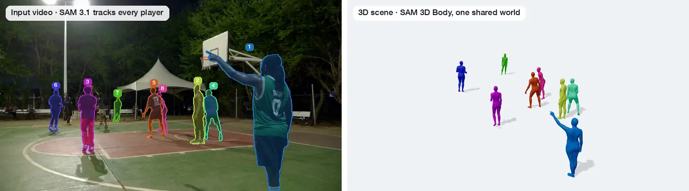
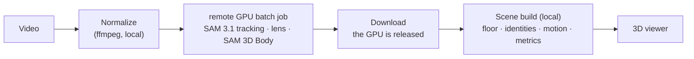

<h1 align="center">Kinesia</h1>

<p align="center"><b>Multi-person 3D motion capture from a single, ordinary video.</b></p>

<p align="center">
  <a href="https://github.com/flyaurelien/kinesia/actions/workflows/ci.yml"></a>
  <a href="LICENSE"></a>
</p>

<p align="center">
  
</p>

<p align="center"><sub>
Streetball at night, filmed from one fixed camera: 18 s at 1080p, 19 people tracked
(up to 13 at a time), each rebuilt in 3D on one shared floor. Colours match between
the two sides. Source video by Khanh Hoang Minh on
<a href="https://www.pexels.com/video/a-group-of-people-playing-basketball-at-night-19570048/">Pexels</a>.
</sub></p>

Kinesia follows every person in a video (a match, a training session, a dance),
reconstructs each of them as a 3D body on every frame, and plays them back
together in one animated scene you can orbit, follow, view from above or see
through the original camera.

## What is hard here, and what Kinesia does about it

| In the clip above | How Kinesia handles it |
| --- | --- |
| A dozen players crossing, screening and hiding each other | **SAM 3.1 video tracking** (Object Multiplex): one session over the whole clip, a memory per person, re-conditioned on fresh detections, so identities hold through crossings and occlusions. |
| One camera, so no depth | **One shared floor.** The lens is measured from the picture (MoGe-2), one floor is fitted under everybody's feet, and each person is slid along their camera ray until their feet meet it. Their image never moves; only the depth error goes away. |
| People cut by the frame or seen from behind | **SAM 3D Body** (Momentum Human Rig) rebuilds the whole body from what is visible, prompted with each person's mask so overlapping players are told apart. Where the feet are cut off, their depth is interpolated from neighbouring frames. |
| Sprints, jumps, sudden turns | **Motion that respects physics.** Body shape is fixed per person, joint rotations are smoothed without lag, the trajectory filter knows that depth is the uncertain direction, and planted feet are pinned (no skating) while jumps keep their height. |
| Players leaving and coming back | **Re-identification.** Fragments are joined using appearance, a running-speed reachability test and a similarity threshold calibrated on each video. |
| Tracker slips | **Masklet cleaning.** Frames where a mask swallows a neighbour are dropped, a track handed over to someone else is cut in two, and people whose feet never reach the floor (spectators in the stands) are left out. |

**Measured on this clip**: 434 frames, focal length 1338 px estimated from the
image, heights between 1.58 and 1.78 m. On one NVIDIA B300, tracking took 92 s
and body reconstruction 104 s; the GPU was held for 4 min 55 s in all and
released when the job ended. The 3D scene was then built locally in 15 s.

The viewer shows when each person is on screen (presence lanes), and gives
distance, speed, jumps and joint angles per person, with CSV and JSON export.

## How it works


```mermaid
flowchart LR
    A[Video] --> B["Normalize<br/>(ffmpeg, local)"]
    B --> C["remote GPU batch job<br/>SAM 3.1 tracking · lens · SAM 3D Body"]
    C --> D["Download<br/>the GPU is released"]
    D --> E["Scene build (local)<br/>floor · identities · motion · metrics"]
    E --> F["3D viewer"]
```

Inference runs on the **remote GPU server** (Kubernetes + the job scheduler) as a *batch*
workload: its pod ends with the computation, so the GPU is released — and the
billing stops — as soon as the results are written, if anything fails, or the
moment you cancel. A hard timeout bounds a job that hangs. Jobs are resumable
stage by stage, so a pre-empted job restarts where it stopped. Waiting for a
GPU costs nothing; when the preferred pool (B300) is full for four minutes the
job moves to the next one (A100).

The scene build needs only the CPU and runs on your machine after the download.

## Setup

**Cluster access** (network access): install `kubectl` and the the job scheduler CLI,
then `scheduler login`. Copy `cluster/config.env.example` to `cluster/config.env`
(git-ignored) and fill in your the job scheduler project, UID/GID, volume claim, and the
paths of the SAM 3.1 checkpoint (`facebook/sam3.1`, `sam3.1_multiplex.pt`), a
clean checkout of `facebookresearch/sam3` and SAM 3D Body
(`facebook/sam-3d-body-dinov3`) on the lab volume. Then, once (this also puts
MoGe-2 and its public weights on the volume):

```bash
uv sync --frozen --no-editable                    # local Python environment
uv run --no-sync python scripts/install_models.py # SAM 3D Body body model + DINOv3 code
uv run --no-sync kinesia cluster setup            # Python packages on the volume (CPU pod)
```

**Local tools:** [`uv`](https://docs.astral.sh/uv/), `ffmpeg`/`ffprobe` on the
`PATH`, and Node.js 24.

## Run

```bash
./dev.sh
```

Open <http://127.0.0.1:4001/>, choose **New analysis**, drop a video. The page
follows the job through its steps (upload, GPU, tracking, camera, bodies,
download, 3D scene) and opens the viewer when it is ready. Cancelling deletes
the cluster job immediately.

Everything is also available from the command line:

```bash
uv run --no-sync kinesia new input/match.mp4 --name "Sunday match" [--prompt "football player"]
uv run --no-sync kinesia process <run-id>                           # GPU job, download, scene
uv run --no-sync kinesia cancel <run-id>                            # delete the job, free the GPU
uv run --no-sync kinesia scene <run-id>                             # rebuild the 3D scene locally
```

Each analysis lives in `output/<run-id>/`: the normalized `video.mp4`, the raw
GPU results in `raw/` and the viewer files in `scene/`.

### Using the viewer

| Control | |
| --- | --- |
| Space · ← → · Shift+← → | play/pause · one frame · one second |
| O · F · T · C | orbit · follow the selected person · top view · through the recording camera, over the video |
| Click a body, a list row, a lane or an outline in the video | select that person |
| Double-click a name | rename |

The toolbar toggles body meshes, skeletons, motion trails, name tags and the
source video (picture-in-picture or side by side). Names and hidden people are
saved with the analysis.

## Capture advice and limits

- **The camera must be fixed** (tripod, stand, or rested on something): one
  camera frame serves the whole clip. A panning, zooming or hand-held camera is
  not supported: even a few degrees of panning slide everyone sideways in 3D.
- Works best when people are seen **whole** and at least ~50 pixels tall. The
  text prompt (default `person`) can be narrowed, e.g. `basketball player`, so
  that spectators are not tracked.
- Clips of up to 6,000 frames (about 3 minutes at 30 fps). SAM 3.1's state
  grows with every frame, by about 19 MB with 20 people: a B300 has room to
  spare, an 80 GB GPU fits about 2,500 frames. A clip too long for the GPU it
  lands on stops within the first minutes, with the reason, rather than near
  the end.
- Depth from one camera is uncertain: distances and speeds are estimates, best
  compared between people of the same clip. Absolute size comes from SAM 3D
  Body's human prior, so unusually tall or short people are pulled towards
  average height (tall athletes come out shorter than they are), and their
  distances and speeds scale with it.
- Joining fragments is conservative: two players in the same kit who leave and
  re-enter at the same time may stay separate people rather than risk a swap.
- SAM 3.1's multiplex tracker at the pinned upstream revision crashes on long
  clips when an object sharing a conditioning frame is removed
  ([facebookresearch/sam3#572](https://github.com/facebookresearch/sam3/issues/572));
  Kinesia applies the fix proposed upstream (#573) at runtime.

## Development

```bash
PYTHONPATH=src uv run --no-sync python -m unittest discover -s tests   # backend, on the source tree
cd web-viewer && npx tsc --noEmit && npm test && npm run build
```

```text
kinesia/
  cluster/          GPU job and one-time setup scripts (run inside the pods)
  src/kinesia/
    cluster/        the job scheduler/kubectl orchestration from this machine
    remote/         code that runs on the GPU: SAM 3.1 tracking, lens, SAM 3D Body
    scene/          floor, identities, motion smoothing, metrics, export
  web-viewer/       Next.js app: library, processing status, 3D viewer
  vendor/           SAM 3D Body code (uploaded to the cluster with each job)
  tests/            backend tests
```

## Models

All model weights come from their original publishers; none are redistributed here.

| Model | Role | Paper | Weights / code | License |
| --- | --- | --- | --- | --- |
| **SAM 3.1** (Object Multiplex) | video detection, segmentation and tracking | [arXiv:2511.16719](https://arxiv.org/abs/2511.16719) | [facebook/sam3.1](https://huggingface.co/facebook/sam3.1) · [facebookresearch/sam3](https://github.com/facebookresearch/sam3) | SAM License (gated) |
| **SAM 3D Body** | per-person 3D body ([MHR](https://github.com/facebookresearch/MHR)) | [arXiv:2602.15989](https://arxiv.org/abs/2602.15989) | [facebook/sam-3d-body-dinov3](https://huggingface.co/facebook/sam-3d-body-dinov3) · [facebookresearch/sam-3d-body](https://github.com/facebookresearch/sam-3d-body) | SAM License (gated) |
| **DINOv3** | image encoder inside SAM 3D Body | [arXiv:2508.10104](https://arxiv.org/abs/2508.10104) | [facebookresearch/dinov3](https://github.com/facebookresearch/dinov3) | DINOv3 License |
| **MoGe-2** | camera focal length from a single image | [arXiv:2507.02546](https://arxiv.org/abs/2507.02546) | [Ruicheng/moge-2-vitl-normal](https://huggingface.co/Ruicheng/moge-2-vitl-normal) · [microsoft/MoGe](https://github.com/microsoft/MoGe) | MIT (code) / weights per model card |

## Citations

```bibtex
@misc{carion2025sam3segmentconcepts,
  title={SAM 3: Segment Anything with Concepts},
  author={Nicolas Carion and Laura Gustafson and Yuan-Ting Hu and Shoubhik Debnath and Ronghang Hu and Didac Suris and Chaitanya Ryali and Kalyan Vasudev Alwala and Haitham Khedr and Andrew Huang and Jie Lei and Tengyu Ma and Baishan Guo and Arpit Kalla and Markus Marks and Joseph Greer and Meng Wang and Peize Sun and Roman R{\"a}dle and Triantafyllos Afouras and Effrosyni Mavroudi and Katherine Xu and Tsung-Han Wu and Yu Zhou and Liliane Momeni and Rishi Hazra and Shuangrui Ding and Sagar Vaze and Francois Porcher and Feng Li and Siyuan Li and Aishwarya Kamath and Ho Kei Cheng and Piotr Doll{\'a}r and Nikhila Ravi and Kate Saenko and Pengchuan Zhang and Christoph Feichtenhofer},
  year={2025},
  eprint={2511.16719},
  archivePrefix={arXiv},
  primaryClass={cs.CV},
  url={https://arxiv.org/abs/2511.16719},
}

@article{yang2026sam3dbody,
  title={SAM 3D Body: Robust Full-Body Human Mesh Recovery},
  author={Yang, Xitong and Kukreja, Devansh and Pinkus, Don and Sagar, Anushka and Fan, Taosha and Park, Jinhyung and Shin, Soyong and Cao, Jinkun and Liu, Jiawei and Ugrinovic, Nicolas and Feiszli, Matt and Malik, Jitendra and Dollar, Piotr and Kitani, Kris},
  journal={arXiv preprint arXiv:2602.15989},
  year={2026}
}

@misc{simeoni2025dinov3,
  title={{DINOv3}},
  author={Sim{\'e}oni, Oriane and Vo, Huy V. and Seitzer, Maximilian and Baldassarre, Federico and Oquab, Maxime and Jose, Cijo and Khalidov, Vasil and Szafraniec, Marc and Yi, Seungeun and Ramamonjisoa, Micha{\"e}l and Massa, Francisco and Haziza, Daniel and Wehrstedt, Luca and Wang, Jianyuan and Darcet, Timoth{\'e}e and Moutakanni, Th{\'e}o and Sentana, Leonel and Roberts, Claire and Vedaldi, Andrea and Tolan, Jamie and Brandt, John and Couprie, Camille and Mairal, Julien and J{\'e}gou, Herv{\'e} and Labatut, Patrick and Bojanowski, Piotr},
  year={2025},
  eprint={2508.10104},
  archivePrefix={arXiv},
  primaryClass={cs.CV},
  url={https://arxiv.org/abs/2508.10104},
}
```

## License

Kinesia's own code is dedicated to the **public domain** under
[CC0 1.0 Universal](LICENSE). The vendored `vendor/sam-3d-body-main` keeps Meta's
SAM License (included in that directory). Model weights are downloaded from their
original gated sources and remain subject to their own license terms.
`docs/demo.webp` is made from a video on Pexels (credited above), used under the
[Pexels license](https://www.pexels.com/license/).
