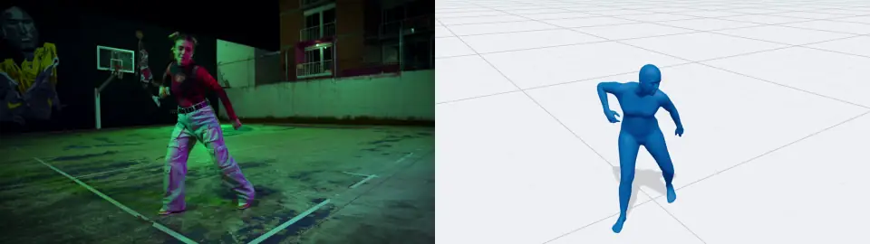
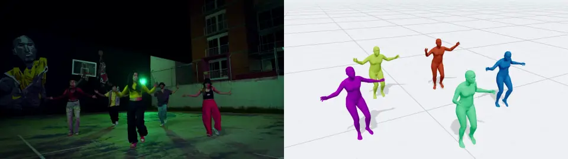
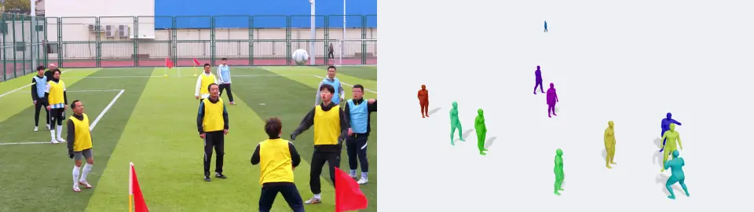
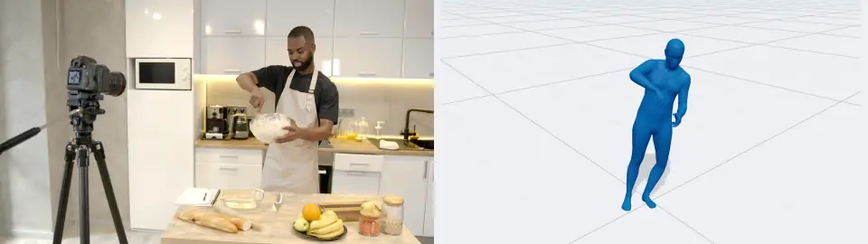
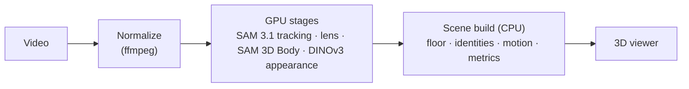

<h1 align="center">Kinesia</h1>

<p align="center"><b>Multi-person 3D motion capture from a single, ordinary video.</b><br>
Drop a clip in the browser: everyone in it comes back as an animated 3D body, on one shared floor.</p>

<p align="center">
  <a href="https://github.com/flyaurelien/kinesia/actions/workflows/ci.yml"></a>
  <a href="LICENSE"></a>
  <a href="#benchmark-3dpw"></a>
</p>

<p align="center">
  
</p>

<p align="center"><sub>
Streetball at night, filmed from one fixed camera: 18 s at 1080p, up to 13 people
at a time, each rebuilt in 3D on one shared floor. Colours match between the two
sides. Source video by Khanh Hoang Minh on
<a href="https://www.pexels.com/video/a-group-of-people-playing-basketball-at-night-19570048/">Pexels</a>.
</sub></p>

Kinesia follows every person in a video (a match, a dance, someone cooking),
reconstructs each of them as a 3D body on every frame, and plays them back
together in one animated scene you can orbit, follow, view from above or see
through the original camera. It turns Meta's per-image models
([SAM 3.1](https://github.com/facebookresearch/sam3),
[SAM 3D Body](https://github.com/facebookresearch/sam-3d-body),
[DINOv3](https://github.com/facebookresearch/dinov3)) into a video system:
one identity per person for the whole clip, motion that is smooth and
physically plausible, and a web app to explore it.

- **Drop a video, get a 3D scene**: a local web app runs the analysis step by
  step and opens the viewer when it is ready.
- **Everyone, all the time**: people are tracked through crossings and
  occlusions, and recognised by their appearance when they come back.
- **Motion you can trust**: jitter halved on the 3DPW benchmark, feet planted
  on the floor, jumps that follow gravity.
- **Measurements**: per-person distance, speed, jumps and joint angles,
  exported as CSV or JSON.

## Examples

<table>
<tr>
<td width="50%"></td>
<td width="50%"></td>
</tr>
<tr>
<td><sub><b>Street dance, solo.</b> Fast turns and kicks; the two painted figures on the wall are recognised as pictures and left out.</sub></td>
<td><sub><b>Street dance, five dancers.</b> Each keeps one identity for the whole clip.</sub></td>
</tr>
<tr>
<td></td>
<td></td>
</tr>
<tr>
<td><sub><b>Amateur football, about fifteen players.</b> Players crossing, hiding each other and running out of the picture.</sub></td>
<td><sub><b>Cooking.</b> The counter hides the legs: the body model predicts them, and the floor is placed under them.</sub></td>
</tr>
</table>

<sub>Source videos: street dance by Mixkit
(<a href="https://mixkit.co/free-stock-video/a-young-woman-wearing-urban-trendy-clothes-dances-on-the-51323/">solo</a>,
<a href="https://mixkit.co/free-stock-video/a-group-of-trendy-urban-young-people-dancing-on-a-51294/">group</a>,
<a href="https://mixkit.co/license/#videoFree">Mixkit license</a>); football by Usman AbdulrasheedGambo and cooking by Gustavo Fring on Pexels
(<a href="https://www.pexels.com/video/31370180/">football</a>,
<a href="https://www.pexels.com/video/8779935/">cooking</a>,
<a href="https://www.pexels.com/license/">Pexels license</a>).</sub>

## Benchmark: 3DPW

[3DPW](https://virtualhumans.mpi-inf.mpg.de/3DPW/) (von Marcard et al., ECCV
2018) is the standard benchmark for 3D human pose in real-world video: people
filmed outdoors with a phone, with ground-truth 3D joints from body-worn
sensors. On the whole **test set** (24 sequences, 34,585 person-frames, 97% of
the frames where a subject is visible), Kinesia is compared with the model it
builds on, SAM 3D Body run on each frame independently:

| Method | MPJPE ↓ (mm) | PA-MPJPE ↓ (mm) | Accel. error ↓ (mm/frame²) |
| --- | ---: | ---: | ---: |
| SAM 3D Body, frame by frame | 60.4 | 40.9 | 13.3 |
| **Kinesia** (tracking, identities, temporal model) | **60.3** | **40.7** | **6.8** (−49%) |

Kinesia halves the jitter (acceleration error) while keeping, and slightly
improving, per-frame accuracy: the smoothing removes noise without lagging
behind the motion. It is better on the acceleration error in all 24 sequences.

<details>
<summary>Protocol</summary>

- Both methods are scored on the same frames and the same 12 joints that the
  SMPL skeleton of the ground truth and the MHR skeleton of SAM 3D Body share
  (shoulders, elbows, wrists, hips, knees, ankles), each pose centred between
  its hips. Joint sets differ from the 14-joint protocol of most papers, so
  these numbers compare the two rows above, not other leaderboards.
- MPJPE: mean joint error in the camera's orientation. PA-MPJPE: the same
  after the best rotation, scale and shift. Accel. error: error of the joints'
  acceleration (Kanazawa et al., CVPR 2019), the usual measure of jitter.
- Each ground-truth subject is matched to a detection by its 2D joints, and
  that detection to the scene person drawn over it.
- 3DPW is filmed with a moving phone, so the analyses use `--moving-camera`:
  the floor, foot-contact and gravity steps, which assume a still camera, are
  off. What is scored is tracking, identities and the temporal model of the
  pose. Reproduce with `scripts/benchmark_3dpw.py` (see its header).
- SAM 3.1 tracking memory grows with the number of people and the length of
  the clip: 10 of the 24 sequences, long and full of passers-by, needed an
  80 GB or 141 GB GPU instead of a 40 GB one.

</details>

## What is hard here, and what Kinesia does about it

| In the clip above | How Kinesia handles it |
| --- | --- |
| A dozen players crossing, screening and hiding each other | **SAM 3.1 video tracking** (Object Multiplex): one session over the whole clip, a memory per person, re-conditioned on fresh detections, so identities hold through crossings and occlusions. |
| One camera, so no depth | **One shared floor.** The lens is measured from the picture (MoGe-2), one floor is fitted under everybody's feet, and each person is slid along their camera ray until their feet meet it. Their image never moves; only the depth error goes away. |
| People cut by the frame or seen from behind | **SAM 3D Body** (Momentum Human Rig) rebuilds the whole body from what is visible, prompted with each person's mask so overlapping players are told apart. Where the feet are cut off, their depth is interpolated from neighbouring frames. |
| Sprints, jumps, sudden turns | **Motion that respects physics.** Body shape is fixed per person and joint rotations are smoothed without lag. Each person's path is solved once for the whole clip, close to the picture but loose in depth (one camera judges distance poorly), with planted feet held still on the floor and the body in free fall while airborne: constant speed across the floor, gravity downwards, as in physics-based motion capture. The legs are then bent by inverse kinematics so that planted feet hold one spot and never sink into the floor. |
| Players leaving and coming back, or swapped while hidden | **Re-identification by appearance.** Each person is cut out with their mask, background greyed, and described by DINOv3 (head, torso and legs separately) and by the colours of their top and bottom. Each video calibrates its own score: the same masklet seconds apart is one person, people seen at the same time are two. A masklet that slides onto someone else during an occlusion is cut where it changes; pieces are then joined most-confident first, never two people seen together, never faster than a sprint, and never when a rival candidate scores nearly as well. |
| Tracker slips | **Masklet cleaning.** Frames where a mask swallows a neighbour are dropped, a track handed over to someone else is cut in two, people whose feet never reach the floor (spectators in the stands) are left out, and so are painted figures (murals, posters), which hold the same pose and the same pixels for seconds. |

**Measured on this clip**: 434 frames, focal length 1338 px estimated from the
image, heights between 1.58 and 1.78 m. On one NVIDIA B300, tracking took 92 s
and body reconstruction 104 s; the 3D scene was then built in 15 s. SAM 3.1's
20 masklet pieces belong to 14 people (checked by hand, frame by frame):
re-identification finds 15, with every return of a player who left the picture
or was hidden for 7 s, and the two players whose masklets swapped during a
screen given back their own identity; no two people are ever merged.

The viewer shows when each person is on screen (presence lanes), and gives
distance, speed, jumps and joint angles per person, with CSV and JSON export.


## How it works


```mermaid
flowchart LR
    A[Video] --> B["Normalize<br/>(ffmpeg)"]
    B --> C["GPU stages<br/>SAM 3.1 tracking · lens · SAM 3D Body · DINOv3 appearance"]
    C --> D["Scene build (CPU)<br/>floor · identities · motion · metrics"]
    D --> E["3D viewer"]
```

The GPU stages run on your NVIDIA GPU, in a child process of the analysis.
Each stage is saved as soon as it completes, so an interrupted analysis resumes
where it stopped, and cancelling stops the GPU work at once. The scene build
needs only the CPU.

## Setup

**Requirements:** Linux with an NVIDIA GPU and its CUDA driver, with about
32 GB of GPU memory for a short clip (see [Capture advice](#capture-advice-and-limits)
for longer ones); [`uv`](https://docs.astral.sh/uv/), `ffmpeg`/`ffprobe` on the
`PATH`, and Node.js 24 for the web app.

SAM 3.1 and SAM 3D Body are gated: accept their licenses on Hugging Face
([facebook/sam3.1](https://huggingface.co/facebook/sam3.1),
[facebook/sam-3d-body-dinov3](https://huggingface.co/facebook/sam-3d-body-dinov3))
and log in with `hf auth login`. Then, once:

```bash
uv sync --frozen --no-editable                     # Python environment
bash scripts/install_gpu.sh                        # SAM 3.1, SAM 3D Body and MoGe-2 packages
uv run --no-sync python scripts/install_models.py  # model weights into models/
uv run --no-sync kinesia doctor                    # checks the GPU and the model files
```

Model files can live elsewhere: set their paths in `local.env` (see
`local.env.example`). Without a GPU, the web app still builds and plays scenes
made on another machine (`install_models.py --scene-only`).

## Run

```bash
./dev.sh
```

Open <http://127.0.0.1:4001/>, choose **New analysis**, drop a video. The page
follows the analysis through its steps (prepare, tracking, camera, bodies,
appearance, 3D scene) and opens the viewer when it is ready.

Everything is also available from the command line:

```bash
uv run --no-sync kinesia new input/match.mp4 --name "Sunday match"          # add --moving-camera for a moving camera
uv run --no-sync kinesia process <run-id>                           # GPU stages, then the 3D scene
uv run --no-sync kinesia cancel <run-id>                            # stop it; the GPU is freed
uv run --no-sync kinesia scene <run-id>                             # rebuild the 3D scene
uv run --no-sync kinesia appearance <run-id> [--device mps]         # older analyses: add appearance, rebuild
```

Analyses made before the appearance stage existed still build, with SAM 3D
Body's own image features standing in (they tell people apart less well);
`kinesia appearance` adds the stage on any CUDA or Apple GPU.

Each analysis lives in `output/<run-id>/`: the normalized `video.mp4`, the raw
GPU results in `raw/`, the viewer files in `scene/` and the GPU log in `gpu.log`.

### Using the viewer

| Control | |
| --- | --- |
| Space · ← → · Shift+← → | play/pause · one frame · one second |
| O · F · T · C | orbit · follow the selected person · top view · through the recording camera, over the video |
| Click a body, a list row, a lane or an outline in the video | select that person |
| Double-click a name | rename |

The toolbar toggles body meshes, skeletons, motion trails, name tags and the
source video (picture-in-picture or side by side). Names and hidden people are
saved with the analysis.

## Capture advice and limits

- **The camera must be fixed** (tripod, stand, or rested on something): one
  camera frame serves the whole clip. A panning, zooming or hand-held camera is
  not supported for the full pipeline: even a few degrees of panning slide
  everyone sideways in 3D. For such clips, `kinesia new --moving-camera`
  keeps tracking, identities and pose smoothing and skips the floor, foot
  and gravity steps (this is how the 3DPW benchmark is run).
- Works best when people are seen **whole** and at least ~50 pixels tall.
  SAM 3.1 is prompted with `person`, which finds the most people: on two test
  clips it found 90% and 97% of everyone that any prompt found, against 86%
  and 54% for `human`, and under 55% for `player` or `athlete`. Spectators in
  the stands are left out by the floor test, not by the prompt.
- Clips of up to 6,000 frames (about 3 minutes at 30 fps). SAM 3.1's state
  grows with every frame, by about 19 MB with 20 people: measured peaks were
  29 GB of GPU memory for 434 frames with up to 13 people, and 48 GB for 1,261
  frames with about 20. A clip too long for the GPU stops within the first
  minutes, with the reason, rather than near the end.
- Depth from one camera is uncertain: distances and speeds are estimates, best
  compared between people of the same clip. Absolute size comes from SAM 3D
  Body's human prior, so unusually tall or short people are pulled towards
  average height (tall athletes come out shorter than they are), and their
  distances and speeds scale with it.
- Joining fragments is conservative: when a returning player looks as much
  like two absent people (team-mates in the same kit), they stay a new person
  rather than risk a wrong identity. Appearance is all it goes on: shirt
  numbers are not read.
- SAM 3.1's multiplex tracker at the pinned upstream revision crashes on long
  clips when an object sharing a conditioning frame is removed
  ([facebookresearch/sam3#572](https://github.com/facebookresearch/sam3/issues/572));
  Kinesia applies the fix proposed upstream (#573) at runtime.

## Development

```bash
PYTHONPATH=src uv run --no-sync python -m unittest discover -s tests   # backend, on the source tree
uv run --no-sync python scripts/benchmark_3dpw.py <3DPW>/sequenceFiles/test <run-id>...   # 3DPW scores
cd web-viewer && npx tsc --noEmit && npm test && npm run build
```

```text
kinesia/
  scripts/          install_gpu.sh (GPU packages), install_models.py (model weights),
                    benchmark_3dpw.py (3DPW scores)
  src/kinesia/
    pipeline.py     the steps of an analysis and the runner that carries them out
    inference/      the GPU stages: SAM 3.1 tracking, lens, SAM 3D Body, appearance
    scene/          floor, identities, motion smoothing, metrics, export
  web-viewer/       Next.js app: library, processing status, 3D viewer
  vendor/           SAM 3D Body code (the GPU stages import it)
  tests/            backend tests
```

## Models

All model weights come from their original publishers; none are redistributed here.

| Model | Role | Paper | Weights / code | License |
| --- | --- | --- | --- | --- |
| **SAM 3.1** (Object Multiplex) | video detection, segmentation and tracking | [arXiv:2511.16719](https://arxiv.org/abs/2511.16719) | [facebook/sam3.1](https://huggingface.co/facebook/sam3.1) · [facebookresearch/sam3](https://github.com/facebookresearch/sam3) | SAM License (gated) |
| **SAM 3D Body** | per-person 3D body ([MHR](https://github.com/facebookresearch/MHR)) | [arXiv:2602.15989](https://arxiv.org/abs/2602.15989) | [facebook/sam-3d-body-dinov3](https://huggingface.co/facebook/sam-3d-body-dinov3) · [facebookresearch/sam-3d-body](https://github.com/facebookresearch/sam-3d-body) | SAM License (gated) |
| **DINOv3** | image encoder inside SAM 3D Body; ViT-H+ alone describes each person's appearance | [arXiv:2508.10104](https://arxiv.org/abs/2508.10104) | [timm/vit_huge_plus_patch16_dinov3.lvd1689m](https://huggingface.co/timm/vit_huge_plus_patch16_dinov3.lvd1689m) · [facebookresearch/dinov3](https://github.com/facebookresearch/dinov3) | DINOv3 License |
| **MoGe-2** | camera focal length from a single image | [arXiv:2507.02546](https://arxiv.org/abs/2507.02546) | [Ruicheng/moge-2-vitl-normal](https://huggingface.co/Ruicheng/moge-2-vitl-normal) · [microsoft/MoGe](https://github.com/microsoft/MoGe) | MIT (code) / weights per model card |

## Citations

```bibtex
@misc{carion2025sam3segmentconcepts,
  title={SAM 3: Segment Anything with Concepts},
  author={Nicolas Carion and Laura Gustafson and Yuan-Ting Hu and Shoubhik Debnath and Ronghang Hu and Didac Suris and Chaitanya Ryali and Kalyan Vasudev Alwala and Haitham Khedr and Andrew Huang and Jie Lei and Tengyu Ma and Baishan Guo and Arpit Kalla and Markus Marks and Joseph Greer and Meng Wang and Peize Sun and Roman R{\"a}dle and Triantafyllos Afouras and Effrosyni Mavroudi and Katherine Xu and Tsung-Han Wu and Yu Zhou and Liliane Momeni and Rishi Hazra and Shuangrui Ding and Sagar Vaze and Francois Porcher and Feng Li and Siyuan Li and Aishwarya Kamath and Ho Kei Cheng and Piotr Doll{\'a}r and Nikhila Ravi and Kate Saenko and Pengchuan Zhang and Christoph Feichtenhofer},
  year={2025},
  eprint={2511.16719},
  archivePrefix={arXiv},
  primaryClass={cs.CV},
  url={https://arxiv.org/abs/2511.16719},
}

@article{yang2026sam3dbody,
  title={SAM 3D Body: Robust Full-Body Human Mesh Recovery},
  author={Yang, Xitong and Kukreja, Devansh and Pinkus, Don and Sagar, Anushka and Fan, Taosha and Park, Jinhyung and Shin, Soyong and Cao, Jinkun and Liu, Jiawei and Ugrinovic, Nicolas and Feiszli, Matt and Malik, Jitendra and Dollar, Piotr and Kitani, Kris},
  journal={arXiv preprint arXiv:2602.15989},
  year={2026}
}

@misc{simeoni2025dinov3,
  title={{DINOv3}},
  author={Sim{\'e}oni, Oriane and Vo, Huy V. and Seitzer, Maximilian and Baldassarre, Federico and Oquab, Maxime and Jose, Cijo and Khalidov, Vasil and Szafraniec, Marc and Yi, Seungeun and Ramamonjisoa, Micha{\"e}l and Massa, Francisco and Haziza, Daniel and Wehrstedt, Luca and Wang, Jianyuan and Darcet, Timoth{\'e}e and Moutakanni, Th{\'e}o and Sentana, Leonel and Roberts, Claire and Vedaldi, Andrea and Tolan, Jamie and Brandt, John and Couprie, Camille and Mairal, Julien and J{\'e}gou, Herv{\'e} and Labatut, Patrick and Bojanowski, Piotr},
  year={2025},
  eprint={2508.10104},
  archivePrefix={arXiv},
  primaryClass={cs.CV},
  url={https://arxiv.org/abs/2508.10104},
}
```

## License

Kinesia's own code is dedicated to the **public domain** under
[CC0 1.0 Universal](LICENSE). The vendored `vendor/sam-3d-body-main` keeps Meta's
SAM License (included in that directory). Model weights are downloaded from their
original gated sources and remain subject to their own license terms.
The animations in `docs/` are made from videos on Pexels and Mixkit (credited
above), used under the [Pexels license](https://www.pexels.com/license/) and the
[Mixkit license](https://mixkit.co/license/#videoFree). 3DPW is not
redistributed; it is downloaded from its authors under their research license.
